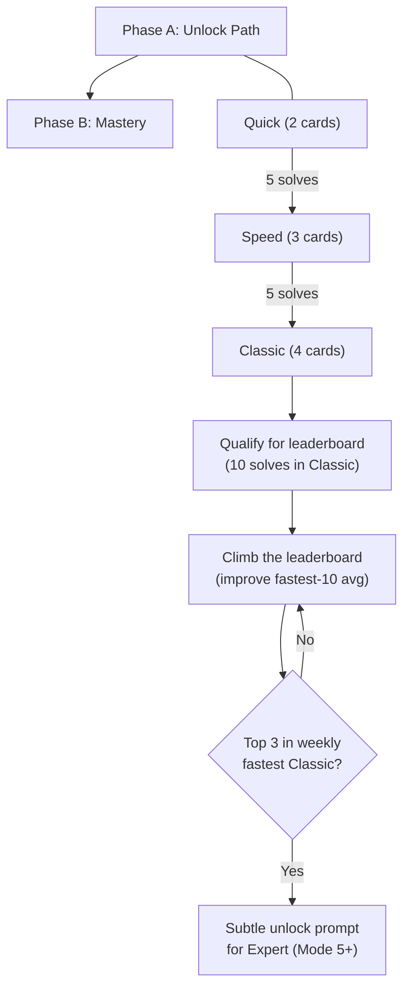

# Progression System & Tutorial Fix

## Problem Frame

Playtesting with ~50 students revealed five interconnected issues:

1. **Tutorial teaches the wrong interaction model.** The tutorial uses card-card-op (select two cards, then operator), but the game now uses card-op-card (select card, pick operator, tap second card). Every new player learns the wrong flow and gets frustrated when the real game works differently.

2. **No sense of progress.** Kids solve puzzles with no visible indicator of how far they've come or what's next. The mode-unlock pip dots exist but are too subtle. Kids expressed a wish for a progress bar.

3. **Leaderboard goes unnoticed.** The leaderboard is a small icon in the top-right header. Kids didn't discover it without being told. It needs to be surfaced through gameplay moments, not just navigation.

4. **No "level up" moments.** There's no celebration or pause when something meaningful happens (unlocking a mode, qualifying for the leaderboard). Kids feel like they're grinding with no payoff, which risks burnout.

5. **Two player types aren't served.** Competitive kids want rank comparison. Self-improvement kids want to beat their own times. The current UI doesn't strongly serve either.

**Key design decision:** Classic (Mode 4, Make 24 with 4 cards) is the destination — the educational sweet spot for Alpha School. Modes 5-9 are bonus content for kids who want extra challenge, not part of the main progression path.

## Progression Model

The progression has two phases with a natural transition:

**Phase A** (new player → Classic): Progress bar tracks mode unlocks. "3/5 to unlock Speed."

**Phase B** (Classic unlocked): Progress bar shifts to leaderboard performance in the currently selected mode. Shows rank in weekly fastest-10 and what's needed to improve. The bar follows mode switches — selecting Expert shows Expert rank/qualification.

## Requirements

**Tutorial Fix (Bug)**

- R1. The tutorial must use the card-op-card interaction model (tap card → tap operator → tap second card), matching the current game behavior.
- R2. Tutorial instruction text must reflect the new flow in both the welcome screen and in-game prompts: "Tap a card" → "Pick an operation" → "Tap a second card to combine."
- R3. The "full" guided hand must highlight the correct elements in sequence: first card → operator button → second card (not first card → second card → operator).
- R3a. The play page footer instruction text must also reflect card-op-card (currently reads "Tap two cards · then an operation").

**Progress Bar**

- R4. A progress bar must be visible on the play page at all times, positioned below the mode pills.
- R5. During Phase A (pre-Classic unlock), the bar shows progress toward the next mode unlock: "3/5 to unlock Speed" with a filled segment.
- R6. During Phase B pre-qualification (Classic unlocked, <10 solves in the currently selected mode), the bar shows leaderboard qualification progress for that mode: "7/10 to qualify for the leaderboard."
- R7. During Phase B post-qualification, the bar shows the player's current leaderboard rank in the currently selected mode's weekly fastest-10: e.g., "#4 in Classic this week." The bar follows mode switches — if the player selects Expert, it shows their Expert rank. If they haven't qualified in the selected mode yet, it falls back to R6 (qualification progress for that mode).
- R8. The progress bar updates immediately after each solve without requiring a page refresh.

**Level-Up Celebrations**

- R9. When a player unlocks a new mode, a full-screen overlay appears celebrating the unlock. The overlay has two actions: "Try [new mode]" (switches to that mode) and "Keep playing" (dismisses and stays on current mode).
- R10. When a player qualifies for the leaderboard in a mode (10th solve), a full-screen overlay celebrates with "You're on the leaderboard!" and offers "See your rank" (navigates to leaderboard filtered to that mode) and "Keep playing."
- R11. Celebration overlays must require a button tap to dismiss — no auto-dismiss.

**Post-Solve Nudges**

- R12. After a successful solve, the win panel shows contextual messages when applicable:
  - If leaderboard rank changed: "You moved up to #3 in Classic!"
  - If close to mode unlock (Phase A, remaining ≤ 2): "1 more to unlock Classic!"
  - If close to leaderboard qualification (remaining ≤ 2): "2 more solves to qualify!"
- R13. The existing PB tag ("New PB! +X HB") continues to appear in the win panel as it does today.
- R14. Nudge messages appear inside the existing win result area — no new UI elements or toast notifications.

**Leaderboard Discovery**

- R15. The primary leaderboard discovery mechanism is the qualification celebration (R10) with its "See your rank" action — not the header icon.
- R15a. The leaderboard page must accept mode, metric, and period as URL search params to support deep-linking from celebration overlays (currently hardcodes initial state).
- R16. The header leaderboard icon remains as a secondary navigation path for returning players.

**Bonus Mode Gate**

- R17. When a player is top 3 in the weekly fastest-10 leaderboard for Classic, a subtle visual prompt appears offering to try Expert (Mode 5). This is an invitation, not a push — the progress bar does not track progress toward higher modes.
- R18. Modes 5-9 remain selectable in the mode picker at any time (once unlocked via the existing 5-solve threshold), independent of leaderboard rank.

## Success Criteria

- New players complete the tutorial and immediately understand card-op-card without confusion.
- Kids can articulate what they're working toward at any point during play ("I need 2 more solves to unlock Classic" or "I'm trying to get to #3 on the leaderboard").
- At least one level-up celebration fires during a typical first session (Quick → Speed unlock at 5 solves, Speed → Classic at 10 total).
- Competitive kids discover the leaderboard through gameplay (qualification overlay) without needing it pointed out.
- Self-improvement kids see PB feedback and rank improvement without being forced into competition.

## Scope Boundaries

- **Not building a daily goals system.** Progression is solve-count and rank driven, not daily target driven.
- **Not changing HB economy.** HB earning rates, PB bonuses, and milestone badges stay as-is.
- **Not redesigning the leaderboard page.** Only changing how players get there and what info surfaces in the play page.
- **Modes 5-9 unlock threshold stays at 5 solves.** The bonus gate (R17) is an additional visual prompt, not a replacement for the existing unlock mechanism.
- **War mode is unaffected.** Progression system applies to solo play only.

## Key Decisions

- **Classic as destination, not waypoint**: The progress bar stops pushing mode unlocks after Classic. Higher modes are bonus content. Rationale: Classic (Make 24) is the pedagogical sweet spot for Alpha School. Pushing kids toward 5+ card modes optimizes for difficulty, not learning.
- **Full overlay celebrations**: Interruptive by design. Rationale: the playtest feedback specifically asked for "a firm level up moment." A subtle banner would repeat the same discoverability problem as the current leaderboard icon.
- **Nudges inside win panel**: No new UI elements for post-solve feedback. Rationale: keeps the solve flow clean and avoids notification fatigue. The win panel already has the player's attention.
- **Leaderboard rank in progress bar**: After qualifying, the bar shows weekly fastest-10 rank, not total solves. Rationale: rank is relative and competitive, giving kids a reason to keep improving even after 100+ solves.

## Dependencies / Assumptions

- The `/api/progress` endpoint currently returns `modeCounts` and `unlockedModes`. It will need to also return leaderboard rank data for the progress bar (Phase B). R6 qualification progress must use mode-specific solve count (e.g., `modeCounts[4]` for Classic), not total solves across all modes.
- The leaderboard ranking logic (weekly fastest-10 average) already exists in the leaderboard page. The progress bar needs access to the same data during normal play.
- The tutorial component (`app/src/app/(child)/play/tutorial.tsx`) exists but its selection state machine is built around card-card-op (operators fire only when 2 cards selected). The fix requires rewriting `handleOp`, `handleTileTap`, highlight logic, and adding `pendingOp` state — mirroring the main game's card-op-card implementation.

## Outstanding Questions

### Deferred to Planning

- [Affects R7, R12][Technical] How to efficiently fetch the player's current leaderboard rank during play without adding latency to every solve. May need a lightweight rank query or caching.
- [Affects R17][Needs research] What visual treatment for the bonus mode prompt? Needs to be noticeable but not pushy — a glow on the Expert pill, a small badge, or a one-time tooltip.
- [Affects R4][Technical] Exact progress bar visual design — whether to match the existing mode-unlock pip style or use a continuous fill bar.

## Next Steps

-> `/ce:plan` for structured implementation planning
