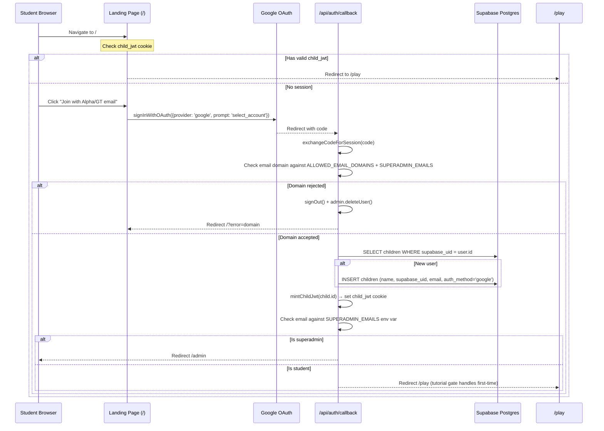

# Google SSO Auth + Landing Page Redesign + Superadmin Dashboard

## Overview

Replace the parent magic link + child PIN auth with Google SSO restricted to `@gt.school` emails, redesign the landing page with GT Math branding, gate legacy parent routes, and add a superadmin dashboard for classroom visibility. The existing game API contract (`child_jwt` cookie) is preserved — the SSO callback creates a `children` row and mints a `child_jwt` just like the current PIN flow, so all downstream APIs remain unchanged.

## Problem Frame

The current landing page is generic and the auth flow (parent magic link + child 4-digit PIN) doesn't match GT/Alpha School's infrastructure where students already have `@gt.school` Google accounts. Students need a one-click SSO flow. The superadmin needs visibility into all student activity for classroom management. (see origin: `docs/brainstorms/landing-page-google-sso-requirements.md`)

## Requirements Trace

- R1. Landing page: "GT Math" brand + tagline
- R2. Google SSO CTA for existing Alpha/GT students
- R3. "For Parents — Coming Soon" (gated routes, not just hidden UI)
- R4. Supabase Google OAuth, configurable domain allowlist, layered domain enforcement
- R5. Superadmin as a role flag, initially `pkuperman@gmail.com`
- R6. Auto-create `children` row on first Google login (nullable `pin_hash`)
- R7. New users → tutorial (`tutorial_seen = false`), returning → `/play`, authenticated on `/` → redirect to `/play`
- R8. Superadmin dashboard: aggregate engagement, student list, per-student drill-down
- R9. Admin controls: reset HB, deactivate accounts, audit logging

## Scope Boundaries

- Parent auth code preserved but routes gated (redirect to `/`)
- No data migration from old PIN-based accounts — fresh start
- Game mechanics, HB economy, leaderboards, war mode unchanged
- Superadmin dashboard is functional, not elaborate
- COPPA: school-use exception applies (see origin: Key Decisions)

## Context & Research

### Relevant Code and Patterns

- **Auth callback** (`app/src/app/api/auth/callback/route.ts`): Already provider-agnostic — `exchangeCodeForSession(code)` works for Google OAuth unchanged. Needs domain check + auto-create + child_jwt minting added
- **JWT minting** (`app/src/lib/jwt.ts`): `mintChildJwt(childId)` creates HS256 JWT with `child_id` claim, 24h expiry. Reused directly in new callback
- **Proxy** (`app/src/proxy.ts`): Matcher `["/dashboard/:path*", "/play/:path*", "/pin/:path*"]`. Middleware checks `child_jwt` OR Supabase user session
- **Game APIs**: All 4 routes (`/api/solve`, `/api/progress`, `/api/tutorial`, `/api/leaderboard`) auth via `child_jwt` cookie + `verifyChildJwt()`. All use `createServiceClient()` (bypasses RLS). These remain untouched. Note: admin API routes also use `createServiceClient()` — admin auth is enforced at the application layer (env var check), not via RLS
- **Parent dashboard** (`app/src/app/(parent)/dashboard/page.tsx`): Fetches children via `/api/children`, shows cards with stats (solves, HB, streak, modes, milestones). Pattern to follow for superadmin
- **Tutorial** (`app/src/app/(child)/play/tutorial.tsx`): 3-hand progressive walkthrough with skip option. `tutorial_seen` flag on `children` table, fetched via `/api/progress`, set via `PATCH /api/tutorial`
- **`create_child(p_parent_id, p_name, p_pin_hash)`**: SECURITY DEFINER function that inserts into `children` + `parent_children` atomically. Needs a new SSO variant that skips `parent_children`
- **Orphan cleanup trigger**: Fires on `parent_children` DELETE. SSO children never have `parent_children` entries, so the trigger never fires for them — no modification needed

### Institutional Learnings

- **Use `jose`, not `jsonwebtoken`** — `jsonwebtoken` crashes on Vercel Edge Runtime (`docs/solutions/best-practices/coppa-compliant-child-auth-supabase-custom-jwt-2026-05-15.md`)
- **RLS claim pattern**: Existing policies read `current_setting('request.jwt.claims', true)::json->>'child_id'`. Admin access uses env var check at application layer, not RLS
- **HB balance from ledger**: Query last `balance_after` from `hb_transactions`, never a cached column. Use `fmtHB()` formatter
- **Next.js 16**: Middleware file is `proxy.ts` with `export function proxy()`, not `middleware.ts`
- **Tri-state loading** (`null | false | true`): Pattern used by tutorial gate in play page. Apply same pattern for auth state checks on landing page

## Key Technical Decisions

- **Extend `children` table, don't create a new table**: Add `supabase_uid`, `email`, `auth_method` columns. Make `pin_hash` nullable. Preserves all FK relationships, leaderboard functions, and RLS policies
- **Callback mints `child_jwt`**: After Google SSO, the callback creates/finds the `children` row and mints a `child_jwt` cookie. All game APIs continue using `child_jwt` unchanged. The Supabase Auth session is also preserved (needed for superadmin dashboard auth)
- **Superadmin via env var check (no `admins` table)**: Check authenticated user's email against `SUPERADMIN_EMAILS` env var directly in callback, proxy, and admin API routes. Adding/removing admins = update env var. No database table, no upsert, no extra RLS. Simpler and the env var is already authoritative for domain bypass
- **Force Google account chooser**: Pass `queryParams: { prompt: "select_account" }` to `signInWithOAuth()` for shared Chromebook support
- **Superadmin dashboard uses Supabase session auth** (not `child_jwt`): Admin API routes call `supabase.auth.getUser()` + check email against `SUPERADMIN_EMAILS`. Uses `createServiceClient()` for data queries (same pattern as existing parent APIs)
- **Domain allowlist via env var**: `ALLOWED_EMAIL_DOMAINS=gt.school` + `SUPERADMIN_EMAILS=pkuperman@gmail.com`. Callback checks both. Note: `SUPERADMIN_EMAILS` doubles as a domain bypass — any email listed there bypasses the domain gate AND gets admin access. If a non-admin observer needs access in the future, a separate bypass list would be needed
- **`child_jwt` cookie security**: Set with `httpOnly: true`, `secure: true`, `sameSite: 'lax'`, `path: '/'`, `maxAge: 86400`. `SameSite=Lax` allows the OAuth redirect (top-level navigation) while blocking cross-site POST (CSRF protection for sign-out)
- **Deactivation enforcement**: `deactivated_at` column on `children` is checked at three points: (1) auth callback refuses to mint `child_jwt` if deactivated, redirects to `/?error=deactivated`; (2) proxy redirects to `/` if `child_jwt` belongs to a deactivated child; (3) game API routes return 403 if deactivated. This makes deactivation immediately effective

## Open Questions

### Resolved During Planning

- **Orphan cleanup trigger**: SSO children have no `parent_children` rows, so the trigger never fires for them. No change needed
- **Dual session coexistence**: Both Supabase Auth session and `child_jwt` cookie persist. Proxy checks `child_jwt` first (for `/play`), Supabase session for `/admin`. No conflict
- **Google consent screen mode**: Must be "External" (not "Internal") because superadmin uses `@gmail.com` — "Internal" only allows the Workspace's own domain. For <100 users, "Testing" mode works but requires each email to be added as a test user manually

### Deferred to Implementation

- Exact Google Cloud console setup steps (project, consent screen, credentials)
- Whether `user.user_metadata.full_name` is always populated for `@gt.school` Google Workspace accounts — may need fallback to email prefix

## High-Level Technical Design

> *This illustrates the intended approach and is directional guidance for review, not implementation specification.*

## Implementation Units

- [ ] **Unit 1: Database migration — schema + functions + RLS**

**Goal:** Prepare the database for SSO users and superadmin access

**Requirements:** R4, R5, R6, R8, R9

**Dependencies:** None

**Files:**
- Create: `app/supabase/migrations/20260515100001_google_sso_schema.sql`

**Approach:**
- ALTER `children`: make `pin_hash` nullable, add `supabase_uid UUID UNIQUE REFERENCES auth.users(id)`, `email TEXT`, `auth_method TEXT NOT NULL DEFAULT 'pin' CHECK (auth_method IN ('pin', 'google'))`, `deactivated_at TIMESTAMPTZ DEFAULT NULL`
- CREATE `admin_audit_log` table: `id BIGINT GENERATED ALWAYS AS IDENTITY PRIMARY KEY`, `admin_email TEXT NOT NULL`, `action TEXT NOT NULL CHECK (action IN ('reset_hb', 'deactivate', 'reactivate'))`, `target_child_id UUID NOT NULL REFERENCES children(id)`, `created_at TIMESTAMPTZ NOT NULL DEFAULT now()`
- CREATE `create_child_sso(p_supabase_uid UUID, p_name TEXT, p_email TEXT)` SECURITY DEFINER function — inserts into `children` only (no `parent_children`), returns child UUID
- ALTER `hb_transactions` CHECK constraint: add `'ADMIN_RESET'` to allowed types (`DROP CONSTRAINT` + re-add with expanded list)
- Enable RLS on `admin_audit_log` (no SELECT policy needed — admin reads via `createServiceClient()`)

**Patterns to follow:**
- Existing migration naming: `app/supabase/migrations/20260515000001_initial_schema.sql`
- Existing RLS pattern: `app/supabase/migrations/20260515000002_rls_policies.sql`
- SECURITY DEFINER pattern: `create_child()` in initial schema

**Test scenarios:**
- Happy path: SSO user record can be created with NULL pin_hash via `create_child_sso()`
- Happy path: `ADMIN_RESET` type inserts into `hb_transactions` without constraint violation
- Edge case: `create_child_sso()` with duplicate `supabase_uid` raises unique constraint violation
- Edge case: `deactivated_at` column accepts NULL (active) and TIMESTAMPTZ (deactivated)
- Integration: Existing PIN-based `create_child()` continues to work unchanged (pin_hash still accepted)

**Verification:**
- Migration applies cleanly against the existing schema
- Existing leaderboard functions, `record_solve()`, and `compound_daily()` still work
- `pin_hash` nullable does not break existing PIN login flow

---

- [ ] **Unit 2: Auth callback overhaul — domain enforcement + auto-create + routing**

**Goal:** Transform the OAuth callback into the SSO entry point: check domain, create/find child, mint child_jwt, route by role

**Requirements:** R4, R5, R6, R7

**Dependencies:** Unit 1 (schema must exist)

**Files:**
- Modify: `app/src/app/api/auth/callback/route.ts`

**Approach:**
- After `exchangeCodeForSession(code)`, get user via `supabase.auth.getUser()`
- Extract email domain, check against `ALLOWED_EMAIL_DOMAINS` env var (comma-separated) and `SUPERADMIN_EMAILS` env var
- If rejected: sign out via `supabase.auth.signOut()`, then delete auth.users row via `createServiceClient().auth.admin.deleteUser(user.id)` (best-effort — if delete fails, still redirect). Redirect to `/?error=domain`. Note: callback needs both `createClient()` (for session exchange + signOut) and `createServiceClient()` (for deleteUser + create_child_sso RPC)
- If accepted: query `children WHERE supabase_uid = user.id` (UNIQUE constraint guarantees at most one match)
- If no child exists: call `create_child_sso()` via service client RPC. If child exists: use existing `children.id`
- If child has `deactivated_at IS NOT NULL`: sign out, redirect to `/?error=deactivated` with message "Your account has been deactivated. Contact your teacher."
- Mint `child_jwt` cookie via `mintChildJwt(childId)` — set on the `NextResponse.redirect()` object via `response.cookies.set('child_jwt', token, { httpOnly: true, secure: true, sameSite: 'lax', path: '/', maxAge: 86400 })`. Supabase session cookies are set separately by `createClient()` via the imperative `cookies()` API
- Check if email is in `SUPERADMIN_EMAILS` env var (direct string comparison, no DB query)
- Validate `next` query param against exact-match allowlist (`['/play', '/admin']`). Reject any other value silently (fall back to default). Default: if superadmin → `/admin`, else `/play`
- Redirect to final destination
- Display name: use `user.user_metadata.full_name`, fallback to email prefix before `@`

**Patterns to follow:**
- Existing callback: `app/src/app/api/auth/callback/route.ts`
- JWT minting: `app/src/lib/jwt.ts` — `mintChildJwt()`
- Service client: `app/src/lib/supabase/server.ts` — `createServiceClient()`

**Test scenarios:**
- Happy path: `@gt.school` email → children row created → child_jwt cookie set → redirect to `/play`
- Happy path: Returning `@gt.school` user → existing children row found → fresh child_jwt → redirect to `/play`
- Happy path: Superadmin email → children row created → redirect to `/admin`
- Error path: `@gmail.com` non-superadmin email → session signed out → auth.users deleted → redirect `/?error=domain`
- Error path: No `code` param → redirect to `/?error=auth_failed`
- Edge case: `next` param with invalid path → falls back to default redirect
- Edge case: Google profile has no `full_name` → email prefix used as display name
- Error path: Deactivated student → session signed out → redirect `/?error=deactivated`
- Integration: After callback, `/api/progress` returns valid data for the new child (child_jwt works end-to-end)
- Integration: `child_jwt` cookie has `httpOnly`, `secure`, `sameSite=lax` flags set

**Verification:**
- A `@gt.school` email can complete the full SSO flow and reach `/play` with a valid `child_jwt`
- A non-allowed email is rejected, sees no game data, and the auth.users row is cleaned up
- The superadmin is identified by `SUPERADMIN_EMAILS` env var match (no database lookup)

---

- [ ] **Unit 3: Landing page redesign**

**Goal:** Replace the current landing page with GT Math branding, Google SSO CTA, error display, and authenticated redirect

**Requirements:** R1, R2, R3, R7

**Dependencies:** Unit 2 (SSO callback must work)

**Files:**
- Modify: `app/src/app/page.tsx`
- Modify: `app/src/app/auth.css` (add any new landing-specific styles)

**Approach:**
- **Server component with client CTA**: The page is a server component that checks `child_jwt` via `cookies()` + `verifyChildJwt()` and redirects to `/play` if valid (or `/admin` if superadmin). No client-side flash — redirect happens before any HTML is sent. The CTA button and error display are a client component (`"use client"`) rendered inside the server shell
- Display GT Math brand mark (`.fm-brand-mark-lg`), title "GT Math" (Archivo 900, 38px), tagline: "Practice Fast Math. Climb Leaderboards. Earn Home Bucks." below in `.fm-login-sub` (15px, `var(--ink-3)`)
- Primary CTA button (`.fm-btn-primary`, full card width): "Join with your Alpha or GT email" — calls `supabase.auth.signInWithOAuth({ provider: 'google', options: { redirectTo: origin + '/api/auth/callback', queryParams: { prompt: 'select_account' } } })`
- Context text above CTA: "For existing Alpha or GT Students" (`.fm-login-sub`)
- "For Parents — Coming Soon" as a `
` with `.fm-link` styling + `pointer-events: none` — renders as muted text (13px, `var(--ink-4)`), no click behavior, no cursor change. Placed 16px below CTA inside `.fm-login-card`
- **Error banner**: Read `?error=domain` or `?error=deactivated` query param. Render inside `.fm-login-card` above CTA in a new `.fm-alert-error` element — full card width, `var(--danger)` 3px left border, `var(--paper)` background, 12px padding. Copy: "GT Math is for Alpha and GT students. Please sign in with your @gt.school email." (for domain) or "Your account has been deactivated. Contact your teacher." (for deactivated). No close button — clears on next CTA click. The error text includes retry guidance so CTA label stays as primary action
- **Loading state**: After CTA click, button shows "Signing in..." with `opacity: 0.4` (existing `.fm-btn:disabled` pattern), `pointer-events: none`
- Reuse existing `fm-login-overlay`, `fm-login-card`, `fm-brand-mark-lg` patterns from `auth.css`

**Patterns to follow:**
- Current landing page structure: `app/src/app/page.tsx`
- Auth CSS patterns: `app/src/app/auth.css` — `fm-login-overlay`, `fm-login-card`, `fm-brand-mark-lg`
- Design tokens: `app/src/app/globals.css`

**Test scenarios:**
- Happy path: Unauthenticated user sees brand, tagline, CTA, and "For Parents" text
- Happy path: Clicking CTA initiates Google OAuth flow (page navigates to Google)
- Happy path: `?error=domain` shows error banner above CTA with retry-friendly message
- Happy path: `?error=deactivated` shows deactivation message
- Edge case: Authenticated user on `/` is server-redirected to `/play` (no HTML sent, no flash)
- Edge case: Authenticated superadmin on `/` is server-redirected to `/admin`
- Edge case: Error banner clears when user clicks CTA to retry

**Verification:**
- Landing page matches R1 branding and R2 CTA copy
- Google SSO flow initiates on button click
- Error message displays and dismisses correctly
- No flash of landing page for authenticated users (server-side redirect)

---

- [ ] **Unit 4: Route gating + proxy updates**

**Goal:** Gate parent routes, add `/admin` to proxy, update middleware auth logic

**Requirements:** R3, R7, R8

**Dependencies:** Unit 1 (schema), Unit 2 (SSO callback sets sessions)

**Files:**
- Modify: `app/src/proxy.ts`
- Modify: `app/src/lib/supabase/middleware.ts`
- Modify: `app/src/app/api/auth/child-login/route.ts` (null pin_hash guard)

**Approach:**
- Update proxy matcher to: `["/dashboard/:path*", "/play/:path*", "/pin/:path*", "/login/:path*", "/admin/:path*", "/api/admin/:path*"]` — note `/api/admin/:path*` is included so admin API routes are also gated at the proxy layer (defense in depth)
- In `updateSession()`:
  - `/login` and `/dashboard`: redirect to `/` (gate parent routes)
  - `/pin`: redirect to `/` (PIN flow replaced by SSO)
  - `/play`: verify `child_jwt` signature via `verifyChildJwt()` (not just cookie presence) — redirect to `/` if invalid. Also check `deactivated_at` — query child by ID from JWT claims via service client, redirect to `/?error=deactivated` if not null
  - `/admin` and `/api/admin`: require Supabase session (`supabase.auth.getUser()`), then check user email against `SUPERADMIN_EMAILS` env var (direct string comparison, no DB query). If not admin, redirect to `/` (page routes) or return 403 (API routes)
- Gate `/api/auth/child-login`: add null-check for `pin_hash` before `bcrypt.compare()` — return 401 if null (protects SSO users with nullable pin_hash)

**Patterns to follow:**
- Current proxy: `app/src/proxy.ts`
- Current middleware: `app/src/lib/supabase/middleware.ts`

**Test scenarios:**
- Happy path: Direct navigation to `/login` redirects to `/`
- Happy path: Direct navigation to `/dashboard` redirects to `/`
- Happy path: Direct navigation to `/pin` redirects to `/`
- Happy path: Authenticated student accessing `/play` passes through
- Happy path: Admin accessing `/admin` passes through
- Error path: Non-admin accessing `/admin` redirects to `/`
- Error path: Non-admin POSTing to `/api/admin/actions` gets 403
- Error path: Unauthenticated user accessing `/play` redirects to `/`
- Error path: Deactivated student accessing `/play` redirects to `/?error=deactivated`
- Error path: Invalid (forged) `child_jwt` cookie redirects to `/` (signature check fails)
- Edge case: Admin can still access `/play` (has valid child_jwt from callback)

**Verification:**
- All parent/PIN routes return redirects
- Admin route + admin API routes accessible only to superadmin
- Game route works for authenticated, non-deactivated students
- Forged or expired `child_jwt` does not pass proxy gate

---

- [ ] **Unit 5: Student sign-out + play page header updates**

**Goal:** Add sign-out UI to the play page, remove the dashboard link, handle session expiry gracefully

**Requirements:** R7

**Dependencies:** Unit 2 (SSO flow), Unit 4 (routing)

**Files:**
- Modify: `app/src/app/(child)/play/page.tsx`
- Create: `app/src/app/api/auth/signout/route.ts`

**Approach:**
- Replace the dashboard link (line ~360 of play/page.tsx) with a sign-out button in the same icon slot. Button shows a door/exit icon + visible text label "Sign out" (not icon-only — elementary students may not understand an icon alone). Minimum 44x44px tap target (add `padding: 12px` to icon button) for touchscreen Chromebooks
- No confirmation dialog on sign-out — the friction of a dialog is worse than an accidental sign-out for this age group. Sign-out mid-hand is allowed and the hand is abandoned (no guard against in-progress games)
- Sign-out button calls `POST /api/auth/signout` which: clears `child_jwt` cookie, calls `supabase.auth.signOut()`, returns JSON with redirect URL. Client-side: `window.location.href = '/'`. The POST response redirects directly so there is no intermediate blank page between sign-out and landing
- **Session-expired overlay**: On 401 from `/api/solve` or `/api/progress`, render a full-screen overlay (reuse `.fm-login-overlay` pattern, z-index above game) with a `.fm-login-card` containing "Your session expired. Sign in again to continue." and a spinner. Redirect to `/` after 2 seconds. This prevents the student from interacting with a broken game state during the delay

**Patterns to follow:**
- Parent sign-out in dashboard: `app/src/app/(parent)/dashboard/page.tsx` line 87-90
- Play page header structure: `app/src/app/(child)/play/page.tsx` lines 330-369
- Overlay pattern: `.fm-login-overlay` in `auth.css`

**Test scenarios:**
- Happy path: Clicking sign-out clears both child_jwt and Supabase session, redirects to `/`
- Happy path: After sign-out, revisiting `/play` redirects to `/` (no stale session)
- Error path: 401 from `/api/solve` shows full-screen expiry overlay and redirects after 2s
- Edge case: Sign-out on shared Chromebook allows next student to log in with different account (Google account chooser via `prompt: select_account`)
- Edge case: Sign-out during an in-progress hand — hand is abandoned, no error

**Verification:**
- Sign-out button visible in play page header with "Sign out" label and 44px tap target
- Both auth sessions cleared on sign-out
- Dashboard link no longer appears for students
- Session-expired overlay blocks game interaction until redirect completes

---

- [ ] **Unit 6: Superadmin dashboard — data views + admin controls**

**Goal:** Build the superadmin dashboard with aggregate engagement, student list, drill-down, and admin controls

**Requirements:** R8, R9

**Dependencies:** Unit 1 (schema), Unit 2 (SSO callback), Unit 4 (admin route gating)

**Files:**
- Create: `app/src/app/(admin)/admin/page.tsx` (student list + aggregate stats)
- Create: `app/src/app/(admin)/admin/students/[id]/page.tsx` (drill-down page)
- Create: `app/src/app/api/admin/students/route.ts`
- Create: `app/src/app/api/admin/students/[id]/route.ts`
- Create: `app/src/app/api/admin/actions/route.ts`
- Modify: `app/src/app/auth.css` (add admin dashboard styles)

**Approach:**
- **Admin auth helper**: All admin API routes call `supabase.auth.getUser()`, then check `user.email` against `SUPERADMIN_EMAILS` env var. Return 403 if not admin. Use `createServiceClient()` for data queries (bypasses RLS). Extract shared `requireAdmin(supabase)` helper to avoid duplication
- **Admin layout**: Reuse `fm-dash-header` pattern from parent dashboard with "Admin Dashboard" title, sign-out button, and "Play" nav link
- `GET /api/admin/students`: Query all active children (`WHERE deactivated_at IS NULL`) with aggregated stats (total solves, HB balance from last `hb_transactions.balance_after`, last activity date, unlocked modes). Also return aggregate: total active today/this week (from `daily_activity`). Validate `childId` as UUID format before any DB query
- `GET /api/admin/students/[id]`: Per-student drill-down — solve history with timestamps/modes/times, HB transaction ledger, speed trends by mode. Validate `id` param as UUID
- `POST /api/admin/actions`: Admin control actions. Body: `{ action: 'reset_hb' | 'deactivate' | 'reactivate', childId }`. Validate `childId` as UUID and verify the child exists before executing. On `reset_hb`: insert HB transaction with `type: 'ADMIN_RESET'`, `balance_after: 0`. On `deactivate`: set `deactivated_at = NOW()`. On `reactivate`: set `deactivated_at = NULL`. All actions logged to `admin_audit_log` with `admin_email`, `action`, `target_child_id`, `created_at`
- **Main page** (`/admin`): Two sections — (a) aggregate stats bar using `.fm-stat-grid` / `.fm-stat` (students active today, total students, total solves this week), (b) student list table with columns: name, email, HB balance, total solves, last active. On viewports below 1280px, email column collapses (visible in drill-down). Clicking a row navigates to `/admin/students/[id]` (separate page, not accordion — keeps the list clean and uses the `[id]` API route naturally)
- **Drill-down page** (`/admin/students/[id]`): Reuses `.fm-dash-header` with a back link to `/admin`. Shows student name, email, and status (active/deactivated). Three sections: solve history table, HB transaction ledger, speed chart by mode. Admin actions ("Reset HB", "Deactivate"/"Reactivate") appear at top
- **Admin action UX**: Two-tap confirmation pattern — first click shows inline confirmation text (e.g., "Reset HB to 0? This cannot be undone." or "Deactivate [name]? They will lose access immediately.") with a confirm button. No modal. During the async call, both action buttons are disabled (`opacity: 0.4`, `cursor: not-allowed`). On success, update the data in place. On failure, show inline error using `.fm-pin-error` styled span
- Use `fmtHB()` pattern for HB display

**Patterns to follow:**
- Parent dashboard layout: `app/src/app/(parent)/dashboard/page.tsx`
- API auth pattern: `app/src/app/api/children/route.ts` (Supabase session auth)
- HB formatting: `fmtHB()` in `app/src/app/(child)/play/page.tsx`
- Stat card components: `.fm-stat-grid`, `.fm-stat`, `.fm-child-card` in `auth.css`

**Test scenarios:**
- Happy path: Admin sees list of all active students with correct stats
- Happy path: Aggregate stats (active today, total solves) are accurate
- Happy path: Clicking a student row navigates to `/admin/students/[id]` with full drill-down
- Happy path: "Reset HB" shows confirmation, on confirm creates `ADMIN_RESET` transaction + audit log entry
- Happy path: "Deactivate" shows confirmation, on confirm sets `deactivated_at` + audit log entry. Student immediately loses `/play` access
- Happy path: "Reactivate" restores access, clears `deactivated_at`
- Error path: Non-admin user gets 403 from admin API routes (proxy gate + inline auth check)
- Error path: Invalid `childId` UUID returns 400
- Edge case: Student with zero solves appears in list with zeroed stats
- Edge case: HB reset shows HB 0 immediately on confirm without page refresh
- Edge case: Deactivated students do not appear in the main list (filtered by `deactivated_at IS NULL`)
- Integration: Audit log entries include correct admin email, action, target, and timestamp

**Verification:**
- Admin dashboard loads with real student data
- Admin controls modify data correctly and are audit-logged
- Two-tap confirmation prevents accidental actions
- Non-admin users cannot access any admin API endpoint (both proxy and inline check)

## System-Wide Impact

- **Auth session model**: After this change, students have BOTH a Supabase Auth session AND a `child_jwt` cookie. The `child_jwt` governs game API access (verified by signature, not just presence). The Supabase session governs admin dashboard access (superadmin only, checked via `SUPERADMIN_EMAILS` env var match). Proxy checks `child_jwt` for `/play`, Supabase session + env var for `/admin`
- **API routes unchanged**: All 4 game API routes (`/api/solve`, `/api/progress`, `/api/tutorial`, `/api/leaderboard`) continue authenticating via `child_jwt` cookie only. No modifications needed
- **Leaderboard**: Remains unchanged. Student names on the leaderboard come from `children.name` which is now populated from Google profile `full_name` (or email prefix fallback) instead of parent input. This means real student names appear on the leaderboard — acceptable for a classroom tool where students already know each other
- **HB economy**: `record_solve()`, `compound_daily()`, and the append-only ledger are completely unchanged. The superadmin dashboard reads from them but never modifies them except through explicit admin actions (`ADMIN_RESET` type)
- **Deactivation enforcement**: A deactivated child is blocked at three layers: (1) auth callback refuses to mint fresh `child_jwt`, (2) proxy rejects existing `child_jwt` for deactivated children, (3) game APIs can optionally check as a third layer. Deactivation is reversible via "Reactivate" admin action
- **Unchanged invariants**: `deal()`, `verify()`, mode progression, unlock thresholds, and all game mechanics are untouched
- **Error propagation**: 401 from game APIs now shows a full-screen "session expired" overlay and redirects to `/` after 2s, instead of being silently swallowed

## Risks & Dependencies

| Risk | Mitigation |
|------|------------|
| Google Cloud console setup complexity (consent screen, credentials) | Document exact setup steps during implementation. "Testing" mode works initially but requires manually adding each student's `@gt.school` email as a test user (~50 entries). Tokens expire after 7 days in Testing mode. For sustained use, publish the app (verified domain). Track this as a follow-up task |
| `user.user_metadata.full_name` empty for some Google Workspace configs | Fallback to email prefix (`john.doe@gt.school` → "John Doe") |
| Shared Chromebook session confusion | Force `prompt: 'select_account'` on every OAuth initiation. Sign-out button has visible "Sign out" label + 44px tap target |
| `auth.admin.deleteUser()` failure on domain rejection leaves orphan auth.users row | Sign out the session first regardless. Orphan auth.users row has no children link and no data — low impact. Could add a cleanup job later |
| Migration breaks existing PIN flow during transition | `pin_hash` is made nullable but existing rows keep their values. PIN login route is gated but code preserved. Rollback: re-add NOT NULL + remove route gate |
| `SUPERADMIN_EMAILS` doubles as domain bypass | Any email in `SUPERADMIN_EMAILS` bypasses the `ALLOWED_EMAIL_DOMAINS` gate AND gets admin access. These are coupled — a non-admin observer with a non-`@gt.school` email cannot be added without also getting admin. Acceptable for current scope; decouple if non-admin observers are needed later |
| Student real names on leaderboard | Google profile `full_name` is stored as `children.name` and appears on the leaderboard visible to all authenticated students. Acceptable for a classroom where students know each other. If privacy becomes a concern, allow students to set a display name |

## Environment Variables (New)

| Variable | Value | Description |
|----------|-------|-------------|
| `ALLOWED_EMAIL_DOMAINS` | `gt.school` | Comma-separated domain allowlist for Google SSO (e.g., `gt.school,alpha.school` for multi-domain) |
| `SUPERADMIN_EMAILS` | `pkuperman@gmail.com` | Comma-separated admin emails — checked directly in callback, proxy, and admin API routes (no DB table). Also bypasses domain gate |

Plus: Google OAuth configured in **Supabase Dashboard** (Authentication > Providers > Google) with Client ID + Secret from Google Cloud Console. No app-side env vars needed for this — Supabase handles it internally.

## Sources & References

- **Origin document:** [docs/brainstorms/landing-page-google-sso-requirements.md](docs/brainstorms/landing-page-google-sso-requirements.md)
- Existing auth: `app/src/lib/jwt.ts`, `app/src/app/api/auth/callback/route.ts`
- Proxy: `app/src/proxy.ts`, `app/src/lib/supabase/middleware.ts`
- Schema: `app/supabase/migrations/20260515000001_initial_schema.sql`
- Parent dashboard pattern: `app/src/app/(parent)/dashboard/page.tsx`
- Tutorial integration: `app/src/app/(child)/play/tutorial.tsx`, `app/src/app/api/tutorial/route.ts`
- COPPA learning: `docs/solutions/best-practices/coppa-compliant-child-auth-supabase-custom-jwt-2026-05-15.md`
